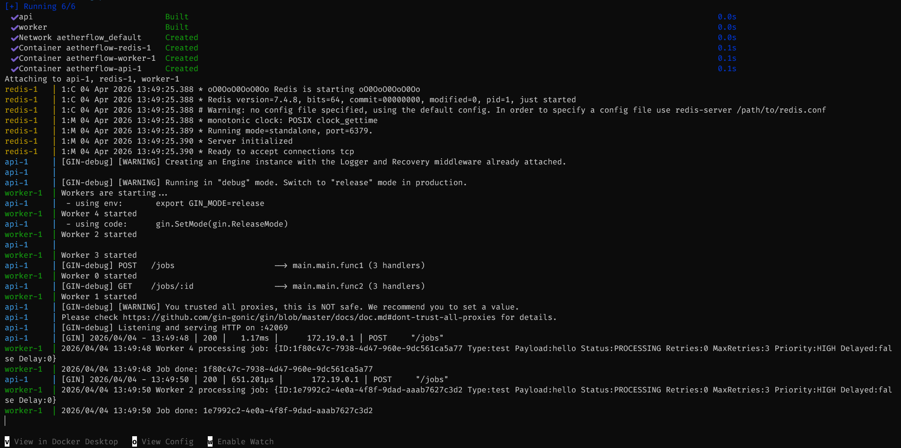

# AetherFlow — Fault-Tolerant Distributed Task Queue

AetherFlow is a lightweight asynchronous job queue system built with Go, Redis, and Gin.
It lets you submit jobs over HTTP, process them with concurrent workers, prioritize execution, schedule delayed jobs, and inspect status by job ID.

## Key Highlights

- Asynchronous background job processing system
- Priority-based scheduling with Redis queues
- Delayed job execution using Redis sorted sets
- Retry mechanism with Dead Letter Queue (DLQ)
- Concurrent worker pool using goroutines
- Fully containerized with Docker Compose

## Why AetherFlow

- Fast API for submitting background jobs.
- Priority queues (`HIGH`, `MEDIUM`, `LOW`) backed by Redis lists.
- Delayed job scheduling via Redis sorted sets.
- Retry flow with dead-letter queue fallback.
- Container-first development with Docker and Docker Compose.

## Tech Stack

- Go 1.25
- Gin Web Framework
- Redis 7
- Docker + Docker Compose

## Project Structure

```text
.
|-- cmd/
|   |-- api/
|   |   `-- server.go        # HTTP API server
|   `-- worker/
|       `-- worker.go        # Queue worker and delayed poller
|-- internal/
|   |-- models/
|   |   `-- models.go        # Job model, status, priority enums
|   `-- queue/
|       `-- redis.go         # Redis queue abstraction
|-- images/
|   `-- docker-compose-running.png
|-- Dockerfile
|-- docker-compose.yml
`-- README.md
```

## Architecture Overview

1. Clients submit jobs to the API (`POST /jobs`).
2. API validates payload, assigns UUID, sets defaults, and pushes to Redis.
3. Worker processes dequeue jobs with priority order:
   - `jobs:HIGH`
   - `jobs:MEDIUM`
   - `jobs:LOW`
4. Delayed jobs are stored in `jobs:delayed` and promoted when due.
5. Failed jobs are retried up to `max_retries`, then moved to `jobs:dlq`.
6. Job state is stored as `job:<id>` in Redis and fetched via `GET /jobs/:id`.

## Job Model

```json
{
  "id": "generated-by-server",
  "type": "email",
  "payload": "{\"to\":\"user@example.com\"}",
  "status": "PENDING",
  "retries": 0,
  "max_retries": 3,
  "priority": "MEDIUM",
  "delayed": false,
  "delay": 0
}
```

Notes:

- `id`, `status`, `retries`, and `max_retries` are controlled by server logic.
- Valid priorities: `LOW`, `MEDIUM`, `HIGH`.
- If `delayed` is `true`, `delay` must be greater than `0` seconds.

## API Endpoints

### `POST /jobs`

Creates a new job (instant or delayed).

Request example (standard priority job):

```bash
curl -X POST http://localhost:42069/jobs \
	-H "Content-Type: application/json" \
	-d '{
		"type": "email",
		"payload": "{\"to\":\"john@example.com\",\"subject\":\"Welcome\"}",
		"priority": "HIGH",
		"delayed": false
	}'
```

Request example (delayed job):

```bash
curl -X POST http://localhost:42069/jobs \
	-H "Content-Type: application/json" \
	-d '{
		"type": "report",
		"payload": "{\"report_id\":42}",
		"priority": "MEDIUM",
		"delayed": true,
		"delay": 30
	}'
```

Sample response:

```json
{
  "job_id": "8f79f77f-f17c-4fdf-b0d4-4d2b47f8a659"
}
```

### `GET /jobs/:id`

Fetches latest job state.

```bash
curl http://localhost:42069/jobs/<job_id>
```

## Run Locally (Without Docker)

Prerequisites:

- Go 1.25+
- Redis running on `localhost:6379`

1. Download dependencies:

```bash
go mod tidy
```

2. Start API:

```bash
go run ./cmd/api/server.go
```

3. Start worker in a separate terminal:

```bash
go run ./cmd/worker/worker.go
```

Environment variables:

- `REDIS_ADDR` (default: `localhost:6379`)
- `GIN_MODE` (optional; use `release` in production-like runs)

## Run With Docker Compose (Recommended)

This starts Redis, API, and Worker together.

```bash
docker compose up --build
```

or

```bash
docker-compose up --build
```

Services:

- API: `http://localhost:42069`
- Redis: `localhost:6379`
- Worker: background consumer

To run detached:

```bash
docker compose up --build -d
```

To stop:

```bash
docker compose down
```

To clean volumes and images used by the stack:

```bash
docker compose down --volumes --rmi local
```

Optional helper script in this repository:

```bash
sh run-compose.sh
```

## Environment Configuration

You can manage runtime values through environment variables.
Current project defaults:

- `REDIS_ADDR=localhost:6379` for local execution
- `REDIS_ADDR=redis:6379` inside Docker Compose
- `GIN_MODE=release` in Compose services

Suggested `.env` content for local development:

```env
REDIS_ADDR=localhost:6379
GIN_MODE=debug
```

## Docker Details

The `Dockerfile` uses a multi-stage build:

- Builder stage compiles both `api` and `worker` binaries.
- Runtime stage copies only built binaries for a smaller final image.

In `docker-compose.yml`:

- `api` runs `./api`
- `worker` runs `./worker`
- both use `REDIS_ADDR=redis:6379`

## Redis Keys Used

- `jobs:HIGH`, `jobs:MEDIUM`, `jobs:LOW` -> Priority queues (lists)
- `jobs:delayed` -> Delayed jobs (sorted set)
- `jobs:dlq` -> Dead letter queue (list)
- `job:<id>` -> Current state per job (string JSON)

## Example End-to-End Flow

1. Submit a job to `POST /jobs`.
2. Capture `job_id` from response.
3. Poll `GET /jobs/:id` for status transitions:
   - `PENDING` -> `PROCESSING` -> `SUCCESS`
   - or `FAILED` after retries and DLQ move

## Screenshots

Compose stack running:



If you want, additional screenshots can be added for:

- API request/response examples
- Redis queue inspection
- Worker logs while processing delayed jobs

## Production Notes

- Add authentication/rate limiting on API endpoints.
- Replace the demo `processJob` logic with real domain handlers.
- Add structured logging and metrics (Prometheus/OpenTelemetry).
- Add graceful shutdown for API and workers.
- Add automated tests (unit + integration with Redis).

## Contributing

1. Fork the repository.
2. Create a feature branch.
3. Commit your changes.
4. Open a pull request.

## License

This project is licensed under the terms of the `LICENSE` file.
